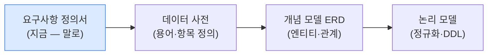

# 요구사항 정의서 — Flowre (플로우리)

> 입점 매장 직원 전용 통합 업무 관리 앱.
> 이 문서는 "무엇을 만들 것인가"를 말로 정리한 첫 번째 설계 산출물이다(아직 표·ERD 아님).
> [데이터 사전](02-data-dictionary.md) → [ERD](03-erd.md) 순서로 이어진다.

---

## 1. 프로젝트 개요

백화점·쇼핑몰 입점 브랜드 매장의 **직원 전용 통합 업무 관리 앱**을 만든다.
스케줄 지시·문서 공유·채팅·재고 관리를 하나의 플랫폼에서 처리하며,
본사(HQ)와 매장 직원 간 실시간 커뮤니케이션 및 업무 현황 모니터링을 지원한다.

---

## 2. 사용자 역할

| 역할 | 설명 | 주요 권한 |
|------|------|----------|
| STORE_STAFF | 매장 일반 직원 | 스케줄 조회·완료 처리, 문서 열람, 채팅, 재고 조회 |
| STORE_MANAGER | 매장 점장 | STORE_STAFF 권한 + 직원 승인·거절, 공지 작성, 운영 상태 변경 |
| HQ_STAFF | 본사 직원 | 전 매장 스케줄·문서·재고 관리, 매장 현황 조회, 직원 계정 발급 |
| ADMIN | 시스템 관리자 | 전체 권한 (부트스트랩 계정) |

---

## 3. 기능적 요구사항

| 번호 | 기능 | 설명 |
|------|------|------|
| FR-01 | 인증·계정 관리 | 이메일·직원코드로 로그인, JWT Access/Refresh 토큰 발급, 비밀번호 초기화, 직원코드 로테이션 |
| FR-02 | 직원 계정 발급 | HQ_STAFF가 STORE_STAFF 계정을 생성(직원코드·초기 비밀번호 포함). 신규 STORE_STAFF는 점장 승인 후 활성화 |
| FR-03 | 스케줄 관리 | 스케줄 등록·수정·삭제·완료 처리. 유형(마네킹/본사방문/VM점검/기타)·상태(대기→진행중→완료)·담당자·마감일 관리 |
| FR-04 | 문서 관리 | S3 Presigned URL 방식 파일 업로드. 카테고리(매뉴얼/공지/리포트) 분류. 브랜드 내 공통 열람 |
| FR-05 | 공지 관리 | 공지 등록·수정·삭제. 핀 고정으로 상단 노출. 직원별 읽음 처리 및 미확인 공지 수 표시 |
| FR-06 | 채팅 | STOMP WebSocket 기반 실시간 채팅. 그룹 채팅(매장 단위)과 1:1 채팅 지원. 텍스트·이미지·파일 첨부 |
| FR-07 | 재고 관리 | 엑셀 업로드 방식 재고 적재. 상품별 수량 조회·차감·증감. 보관함 분리(아카이브) 및 복원 |
| FR-08 | 즐겨찾기 | 메뉴·문서·스케줄·채팅방을 즐겨찾기 등록해 홈 화면에서 빠르게 접근 |
| FR-09 | 인앱 알림 | FCM 푸시 알림 + 앱 내 알림함. 직원 승인 요청·스케줄 마감 임박·재고 부족 알림 |
| FR-10 | 매장 현황 | 매장별 운영 상태(OPEN/CLOSED) 토글. 본사 전용 전 매장 Activity 조회(마지막 활동·스케줄 완료율·활성 직원 수) |
| FR-11 | 감사 로그 | 민감 작업(재고 차감·직원 승인·스케줄 완료 등) 자동 기록. 누가·언제·어떤 대상에 작업했는지 추적 |

---

## 4. 데이터 요구사항

- **브랜드(Brand)**: 입점 브랜드 단위. 모든 데이터의 최상위 격리 기준(`brandId`).
- **매장(Store)**: 브랜드 소속 점포. 고유 코드(4자리)·이름·주소·좌표·운영 상태.
- **직원(User)**: 매장 또는 본사 소속. 역할·상태(ACTIVE/PENDING/REJECTED)·직원코드·FCM 토큰.
- **스케줄(Schedule)**: 매장에 부여된 업무 지시. 유형·상태·마감일·담당자명·설명.
- **문서(Document)**: S3 저장 파일. 제목·카테고리·업로더·파일 크기·MIME 유형.
- **공지(Notice)**: 브랜드 내 전 매장 공유 공지. 핀 고정·작성자명·내용.
- **공지 읽음(NoticeRead)**: 직원별 공지 읽음 처리 기록.
- **채팅방(ChatRoom)**: GROUP(매장 전체) 또는 DIRECT(1:1). 직접 채팅 키로 중복 방지.
- **채팅방 멤버(ChatRoomMember)**: 채팅방 참여 직원 목록. 마지막 읽은 시각 보관.
- **메시지(Message)**: 채팅방 내 메시지. 유형(텍스트/이미지/파일)·발신자·파일명.
- **재고 항목(InventoryItem)**: 매장 보유 상품별 수량·속성. 실시간/보관함(archived) 구분.
- **재고 라벨(InventoryLabel)**: 보관함 분류용 사용자 정의 라벨 (예: VM 스테이징, VIP 예약).
- **재고 이력(InventoryTransaction)**: 재고 차감·증감 이력. 누가 얼마를 왜 변경했는지.
- **즐겨찾기(Favorite)**: 사용자별 메뉴·문서·스케줄·채팅방 북마크.
- **인앱 알림(Notification)**: 수신자별 알림 내용·유형·읽음 여부·연관 리소스.
- **감사 로그(AuditLog)**: 행위자·행위 유형·대상 리소스·상세 설명을 불변 기록.

---

## 5. 제약조건

| 번호 | 제약조건 |
|------|----------|
| C-01 | **브랜드 격리**: 모든 API에서 `brandId` 필터 필수 — 타 브랜드 데이터 접근 불가 |
| C-02 | **매장 격리**: 스케줄·재고·채팅방은 `storeId` 기준으로 격리. 문서·공지는 브랜드 공통 |
| C-03 | **직원 계정 승인**: 신규 STORE_STAFF는 점장(STORE_MANAGER) 승인 전까지 PENDING 상태로 로그인 불가 |
| C-04 | **1:1 채팅 권한**: STORE_STAFF는 같은 매장 직원끼리만 1:1 가능. STORE_MANAGER는 본사 직원(HQ_STAFF)과도 가능 |
| C-05 | **DIRECT 채팅방 중복 방지**: 동일 두 사용자 간 1:1 채팅방은 하나만 존재(directRoomKey UNIQUE 제약) |
| C-06 | **재고 차감 수량 검증**: 재고가 차감량 미만이면 차감 불가 |
| C-07 | **보관함 수량 검증**: 아카이브 수량은 원본 재고 잔량 이하여야 하며, 차감과 동시에 원본 수량 감소 |
| C-08 | **직원코드 유일성**: 브랜드 내 직원코드·이메일은 중복 불가 |
| C-09 | **매장 코드 유일성**: 브랜드 내 매장 코드(4자리)는 중복 불가 |
| C-10 | **JWT 수명**: Access Token 30분, Refresh Token 7일(HttpOnly Cookie). 401 응답 시 자동 갱신 |
| C-11 | **STOMP 인증**: 채팅 WebSocket 연결 시 STOMP CONNECT 헤더에 JWT 포함 |

---

## 6. 비기능 요구사항

| 항목 | 요구사항 |
|------|----------|
| 성능 | 재고 조회 인덱스 최적화 (brand_id + store_id, product_code + barcode) |
| 보안 | 브랜드 격리 필수. STOMP 연결 인증. S3 Presigned URL로 직접 업로드 |
| 확장성 | 브랜드 추가 시 스키마 변경 없이 `brandId` 값만 추가 |
| 알림 | FCM(Firebase Cloud Messaging) Android·iOS 통합 푸시 |
| 배포 | AWS EC2 + Docker + GitHub Actions CI/CD |

---

## 7. 이 산출물의 위치

> 다음 단계 → [데이터 사전](02-data-dictionary.md)에서 용어와 데이터 항목을 표준화한다.
