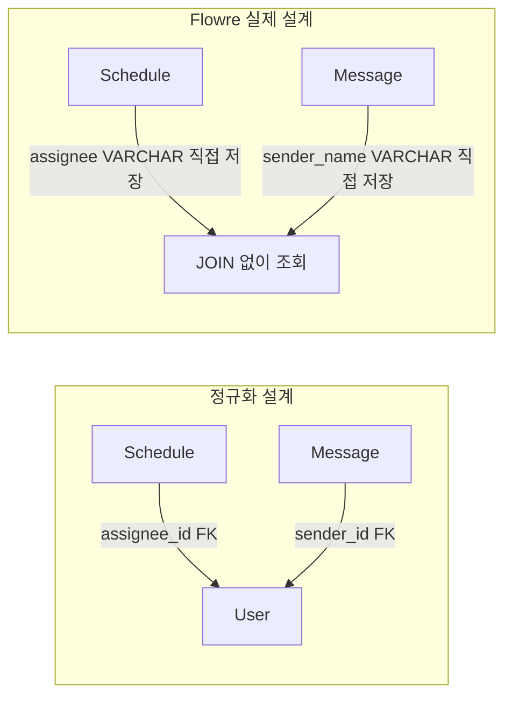
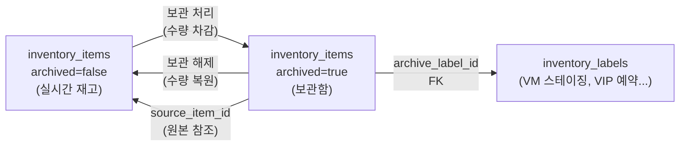

# 개념 모델 ERD — Flowre (플로우리)

> 설계 셋째 산출물(개념적 모델링).
> [요구사항](01-requirements.md) · [데이터 사전](02-data-dictionary.md)을 바탕으로
> **엔티티와 관계**를 다이어그램으로 옮긴다.

---

## 1. 엔티티 도출

요구사항·데이터 사전의 *핵심 명사*에서 엔티티를 뽑았다.

| 엔티티 | 테이블 | 의미 | 분류 |
|--------|--------|------|------|
| Brand (브랜드) | *(외부 관리, brandId만 참조)* | 최상위 격리 단위 | 논리적 |
| Store (매장) | stores | 브랜드의 점포 | 기본 |
| User (직원) | users | 앱 사용자 | 기본 |
| Schedule (스케줄) | schedules | 매장 업무 지시 사건 | 행위 |
| Document (문서) | documents | S3 저장 파일 | 기본 |
| Notice (공지) | notices | 브랜드 공지 | 기본 |
| NoticeRead (읽음) | notice_reads | 공지 읽음 처리 연결 | 연결 |
| ChatRoom (채팅방) | chat_rooms | GROUP / DIRECT 채팅 공간 | 기본 |
| ChatRoomMember (멤버) | chat_room_members | 채팅방-직원 참여 연결 | 연결 |
| Message (메시지) | messages | 채팅방 내 전송 단위 | 행위 |
| InventoryItem (재고) | inventory_items | 매장 보유 상품·수량 | 기본 |
| InventoryLabel (라벨) | inventory_labels | 보관함 분류 태그 | 기본 |
| InventoryTransaction (이력) | inventory_transactions | 재고 변동 사건 | 행위 |
| Favorite (즐겨찾기) | favorites | 사용자 북마크 | 연결 |
| Notification (알림) | notifications | 인앱 알림 단건 | 행위 |
| AuditLog (감사로그) | audit_logs | 민감 작업 불변 이력 | 행위 |

> **분류**: *기본*(혼자 존재) · *행위*(사건/거래) · *연결*(M:N 해소 또는 상태 연결) · *논리적*(물리 테이블 없음)

---

## 2. ERD — 전체 개념 모델

```mermaid
erDiagram
    %% ─── 브랜드 (논리적 엔티티 — 물리 테이블 없음) ───
    Brand ||--o{ Store          : "점포를 가진다"
    Brand ||--o{ User           : "직원을 가진다"
    Brand ||--o{ Notice         : "공지를 가진다"
    Brand ||--o{ Document       : "문서를 가진다"
    Brand ||--o{ ChatRoom       : "채팅방을 가진다"
    Brand ||--o{ InventoryLabel : "라벨을 가진다"

    %% ─── 매장 ───
    Store ||--o{ User           : "직원이 소속된다"
    Store ||--o{ Schedule       : "업무를 받는다"
    Store ||--o{ InventoryItem  : "재고를 보유한다"
    Store ||--o{ ChatRoom       : "그룹 채팅방을 가진다(GROUP만)"

    %% ─── 직원 ───
    User  ||--o{ Schedule       : "생성·담당한다"
    User  ||--o{ Document       : "업로드한다"
    User  ||--o{ Favorite       : "즐겨찾기를 등록한다"
    User  ||--o{ Notification   : "알림을 받는다"
    User  ||--o{ AuditLog       : "행위를 남긴다"

    %% ─── 공지 ───
    Notice    ||--o{ NoticeRead : "읽음 처리된다"
    User      ||--o{ NoticeRead : "공지를 읽는다"

    %% ─── 채팅 ───
    ChatRoom  ||--o{ ChatRoomMember : "멤버를 가진다"
    ChatRoom  ||--o{ Message        : "메시지를 담는다"
    User      ||--o{ ChatRoomMember : "채팅방에 참여한다"

    %% ─── 재고 ───
    InventoryLabel ||--o{ InventoryItem        : "보관 항목을 분류한다"
    InventoryItem  ||--o{ InventoryTransaction : "변동 이력을 남긴다"
    User           ||--o{ InventoryTransaction : "재고를 변경한다"

    %% ─── 엔티티 속성 ───
    Brand {
        bigint  id        PK
        string  name      "브랜드명"
    }
    Store {
        bigint  id               PK
        bigint  brand_id         FK
        string  store_code       "4자리 UNIQUE"
        string  store_name
        string  postal_code
        string  road_address
        double  latitude
        double  longitude
        boolean active           "기본값 true"
        enum    operation_status "OPEN / CLOSED"
        datetime created_at
    }
    User {
        bigint   id              PK
        string   email           "UNIQUE"
        string   employee_code   "UNIQUE"
        string   password        "BCrypt"
        string   name
        enum     role            "STORE_STAFF / STORE_MANAGER / HQ_STAFF / ADMIN"
        enum     status          "ACTIVE / PENDING / REJECTED"
        bigint   brand_id        FK
        bigint   store_id        FK
        string   store_code      "비정규화"
        string   store_name      "비정규화"
        string   fcm_token
        datetime created_at
    }
    Schedule {
        bigint   id          PK
        string   title
        enum     type        "MANNEQUIN / HQ_VISIT / VM_CHECK / OTHER"
        enum     status      "PENDING / IN_PROGRESS / DONE"
        datetime due_date
        string   assignee    "비정규화(담당자명)"
        bigint   store_id    FK
        bigint   brand_id    FK
        text     description
        string   created_by  "비정규화(생성자명)"
        datetime created_at
    }
    Document {
        bigint   id           PK
        string   title
        string   s3_key       "S3 오브젝트 경로"
        enum     category     "MANUAL / NOTICE / REPORT"
        bigint   uploader_id  FK
        string   uploader     "비정규화"
        bigint   brand_id     FK
        string   description
        string   file_type    "MIME 타입"
        bigint   file_size    "bytes"
        datetime created_at
    }
    Notice {
        bigint   id          PK
        bigint   brand_id    FK
        string   title
        text     content
        boolean  pinned      "기본값 false"
        bigint   author_id
        string   author_name "비정규화"
        datetime created_at
        datetime updated_at
    }
    NoticeRead {
        bigint   id         PK
        bigint   notice_id  FK
        bigint   user_id    FK
        datetime read_at
    }
    ChatRoom {
        bigint   id               PK
        enum     type             "GROUP / DIRECT"
        bigint   brand_id         FK
        bigint   store_id         "GROUP만, DIRECT는 NULL"
        string   name             "GROUP: 매장명, DIRECT: 상대방 이름"
        string   direct_room_key  "UNIQUE (DIRECT만)"
        datetime created_at
    }
    ChatRoomMember {
        bigint   id            PK
        bigint   chat_room_id  FK
        bigint   user_id
        string   user_name     "비정규화"
        datetime last_read_at  "NULL = 한 번도 읽지 않음"
    }
    Message {
        bigint   id           PK
        bigint   room_id      FK
        bigint   sender_id
        string   sender_name  "비정규화"
        text     content
        string   file_name    "IMAGE/FILE일 때"
        enum     type         "TEXT / IMAGE / FILE"
        datetime sent_at
        datetime read_at
    }
    InventoryItem {
        bigint   id                PK
        bigint   version           "낙관적 락"
        bigint   brand_id          FK
        bigint   store_id          FK
        string   product_code
        string   product_name
        enum     category          "JACKET/DRESS/SKIRT/..."
        string   barcode
        int      quantity
        boolean  archived          "false=실시간, true=보관함"
        bigint   source_item_id    "보관 시 원본 항목 ID"
        bigint   archive_label_id  FK
        string   archive_item_name
        datetime archived_at
        datetime created_at
    }
    InventoryLabel {
        bigint   id        PK
        bigint   brand_id  FK
        string   name      "브랜드 내 UNIQUE"
        datetime created_at
    }
    InventoryTransaction {
        bigint   id                  PK
        bigint   brand_id            FK
        bigint   store_id            FK
        bigint   inventory_item_id   FK
        string   product_code        "비정규화"
        string   product_name        "비정규화"
        int      quantity            "음수=차감, 양수=증가"
        int      remaining_quantity  "변경 후 잔량"
        string   reason
        bigint   used_by_id          FK
        string   used_by_name        "비정규화"
        datetime created_at
    }
    Favorite {
        bigint   id          PK
        bigint   user_id     FK
        enum     target_type "MENU / DOCUMENT / SCHEDULE / CHAT_ROOM"
        bigint   target_id   "MENU이면 NULL"
        string   target_key  "MENU 식별자"
        string   label
        datetime created_at
    }
    Notification {
        bigint   id           PK
        bigint   brand_id     FK
        bigint   recipient_id FK
        enum     type         "APPROVAL_REQUEST / SCHEDULE_DUE / INVENTORY_LOW / GENERAL"
        string   title
        text     message
        string   related_type
        bigint   related_id
        boolean  is_read      "기본값 false"
        datetime created_at
    }
    AuditLog {
        bigint   id          PK
        bigint   brand_id    FK
        bigint   actor_id    FK
        string   actor_name  "비정규화"
        enum     action      "SCHEDULE_COMPLETED / INVENTORY_DEDUCTED / ..."
        string   target_type
        bigint   target_id
        text     detail
        datetime created_at
    }
```

---

## 3. 관계 정의 (유형 · 카디널리티 · 필수성)

### 핵심 관계

| 관계 | 유형 | 읽는 법 | 비고 |
|------|------|---------|------|
| Brand — Store | 1 : N | 브랜드 하나에 매장 여러 개 | brandId로 묵시적 참조 |
| Brand — User | 1 : N | 브랜드 하나에 직원 여러 명 | brandId로 묵시적 참조 |
| Store — User | 1 : N | 매장 하나에 직원 여러 명 | storeId 참조 |
| Store — Schedule | 1 : N | 매장 하나에 스케줄 여러 개 | storeId 참조 |
| Store — InventoryItem | 1 : N | 매장 하나에 재고 항목 여러 개 | storeId 참조 |
| Notice — NoticeRead | 1 : N | 공지 하나에 읽음 기록 여러 개 | (notice_id, user_id) UNIQUE |
| User — NoticeRead | 1 : N | 직원 하나가 여러 공지를 읽음 | |
| ChatRoom — ChatRoomMember | 1 : N | 채팅방 하나에 멤버 여러 명 | CascadeType.ALL |
| ChatRoom — Message | 1 : N | 채팅방 하나에 메시지 여러 개 | roomId 참조 |
| InventoryLabel — InventoryItem | 1 : N | 라벨 하나에 보관 항목 여러 개 | archiveLabel (보관 항목만) |
| InventoryItem — InventoryTransaction | 1 : N | 재고 항목 하나에 변동 이력 여러 개 | inventoryItemId 참조 |
| User — Favorite | 1 : N | 직원 하나가 즐겨찾기 여러 개 등록 | |
| User — Notification | 1 : N | 직원 하나에 알림 여러 개 수신 | recipientId 참조 |

### 중요 제약

| 관계 | 제약 |
|------|------|
| ChatRoom (DIRECT) | `direct_room_key` UNIQUE — 두 사용자 ID 정렬 조합. 중복 1:1 방 생성 방지 |
| Notice — NoticeRead | `(notice_id, user_id)` UNIQUE — 중복 읽음 불가 |
| ChatRoomMember | `(chat_room_id, user_id)` UNIQUE — 채팅방 중복 입장 불가 |
| InventoryLabel | `(brand_id, name)` UNIQUE — 브랜드 내 라벨명 중복 불가 |
| User | email UNIQUE, employee_code UNIQUE |
| Store | `(brand_id, store_code)` UNIQUE |

---

## 4. 특기 설계 결정

### 비정규화 (Denormalization)

Flowre는 **조회 성능 우선** 설계로 여러 곳에서 의도적 비정규화를 사용한다.

| 비정규화 위치 | 저장 방식 | 이유 |
|--------------|----------|------|
| schedules.assignee | 담당자명 VARCHAR | 스케줄 목록 조회 시 JOIN 제거 |
| schedules.created_by | 생성자명 VARCHAR | 동일 |
| messages.sender_name | 발신자명 VARCHAR | 채팅 메시지 대량 조회 시 JOIN 제거 |
| users.store_code, store_name | 매장 코드·명 VARCHAR | 직원 조회 시 stores JOIN 제거 |
| documents.uploader | 업로더명 VARCHAR | 문서 목록 조회 시 JOIN 제거 |
| inventory_transactions.product_code, product_name, used_by_name | 상품·처리자 정보 | 이력 조회 시 다중 JOIN 제거 |

> **주의**: 비정규화된 값(매장명 등)이 바뀌면 관련 테이블의 값도 함께 갱신해야 한다.

---

### 재고 실시간/보관함 구분

같은 `inventory_items` 테이블에 `archived` 컬럼으로 실시간/보관함을 구분한다.
보관 시 원본 행 수량 감소 + 보관 행 신규 생성, 해제 시 역방향.

---

### 채팅방 타입별 동작

| 구분 | GROUP | DIRECT |
|------|-------|--------|
| store_id | 매장 ID 저장 | NULL |
| name | 매장명 | 상대방 이름 |
| direct_room_key | NULL | "userIdA:userIdB" (정렬된 ID 쌍) |
| 멤버 구성 | 매장 전 직원 자동 입장 | 딱 2명 |
| 1:1 권한 | — | STORE_STAFF: 같은 매장끼리만. STORE_MANAGER: 본사 직원과도 가능 |

---

## 5. ERD 품질 검토

- [x] 요구사항 FR-01~11이 ERD로 모두 표현됐는가?
- [x] 브랜드 격리(C-01): 모든 엔티티에 brand_id 존재
- [x] 매장 격리(C-02): schedules·inventory_items·chat_rooms에 store_id 존재, documents·notices는 brand_id만
- [x] 직원 승인 흐름(C-03): users.status(PENDING→ACTIVE/REJECTED), decided_by_id, decided_at
- [x] 1:1 채팅 중복 방지(C-05): chat_rooms.direct_room_key UNIQUE
- [x] 재고 수량 검증(C-06): quantity 컬럼 + InventoryItem.deduct() 도메인 메서드
- [x] 보관함(C-07): archived + source_item_id 로 원본 추적
- [x] N:M 관계가 연결 엔티티로 해소됐는가? notice_reads(공지↔직원), chat_room_members(채팅방↔직원)
- [x] 모든 엔티티에 PK가 있는가?
- [x] 낙관적 락 필요 위치에 @Version 있는가? (inventory_items.version)

> 이 개념 ERD를 바탕으로 **논리 모델(정규화 검토·인덱스 설계)** → **DDL(CREATE TABLE)** 로 구체화한다.
